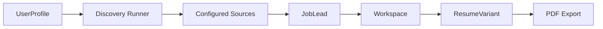
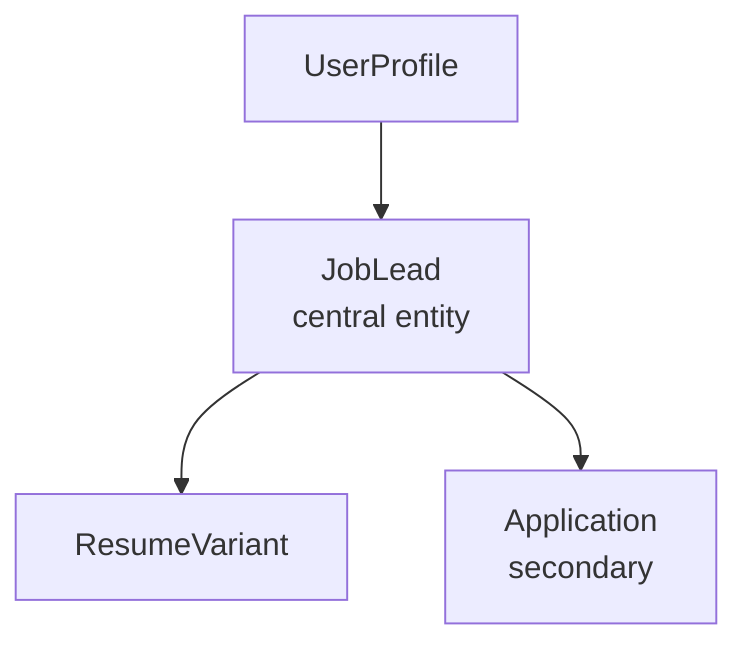
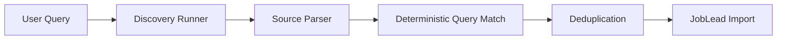

# FindJobApp

Resume-first job discovery with deterministic matching, controlled AI resume tailoring, and ATS-friendly PDF export.

FindJobApp is a Laravel + Vue/Inertia application focused on a practical job-search problem: surfacing useful opportunities from deterministic sources, then helping a user evaluate those leads against a stored resume profile. The core product path is discovery first, explanation second, and AI only where the user explicitly asks for a tailored resume variant.


- 🎥 Demo Video: Coming soon
- 📸 Screenshots: Add screenshots here

## Why This Project Exists

Job search is fragmented, noisy, and often biased toward the same visible platforms. Useful roles can exist on curated public boards, company pages, and regional sources that users do not check consistently.

FindJobApp explores a different approach: start with the resume, discover leads from deterministic sources, and explain overlap using clear keyword signals instead of black-box AI ranking.

## Core Features

- Resume-first user profile with base resume text, core skills, and discovery context
- Deterministic job discovery from explicitly configured sources
- Brazil-first source strategy with curated public boards and company pages
- `JobLead` workspace with matched leads and broader technology leads
- Deterministic keyword extraction, matching, and explanation
- User-triggered `ResumeVariant` generation in `faithful`, `ats_boost`, and `ats_safe` modes
- ATS-friendly PDF export for already stored `ResumeVariant` records
- Diagnostics and observability commands for source inspection and fixture-backed validation

## Architecture Overview



- `UserProfile` provides the resume-first input.
- Discovery imports leads into `JobLead`.
- The workspace is a computed view over `JobLead`.
- `ResumeVariant` is additive and tied to a selected `JobLead`.
- PDF export renders a stored `ResumeVariant` and does not regenerate content.

## Domain Model

`JobLead` is the central entity.



- `UserProfile`
  - Stores base resume text, core skills, and discovery preferences
  - Drives deterministic discovery and matching inputs
- `JobLead`
  - Central workspace record
  - Holds discovered opportunity data, extracted keywords, source metadata, and analysis state
- `ResumeVariant`
  - Belongs to a user and a selected `JobLead`
  - Stores one generated output for one explicit mode
  - Can be exported to PDF without calling AI
- `Application`
  - Secondary workflow entity
  - Intentionally not the architectural center of the product

## Discovery Pipeline

<details>
<summary>Discovery pipeline details</summary>

Discovery is deterministic and source-specific.

- The user triggers discovery from the workspace with `Search new jobs`
- The discovery runner selects enabled sources from config
- Each source uses controlled parsing logic for known listing targets
- Query matching is deterministic and can reuse resume-derived query profiles
- Imports are normalized and deduplicated per user
- Leads are stored as `JobLead` records and grouped by discovery batch



Key constraints:

- No generic crawling of arbitrary user URLs
- No AI enrichment in discovery
- No opaque ranking logic
- URL-only leads remain valid and honest
- Matching explanations stay deterministic and inspectable
</details>

## AI Boundary

> [!IMPORTANT]
> AI is intentionally isolated in this project.

AI is **not** used in:

- discovery
- source parsing
- keyword extraction
- matching
- ranking
- workspace filtering

AI is used **only** for:

- explicit user-triggered `ResumeVariant` generation through Gemini

Additional guardrails:

- PDF export does **not** call AI
- PDF export renders already stored `ResumeVariant` content only
- `ResumeVariant` does not affect discovery, matching, ranking, or workspace behavior

## Tech Stack

### Backend

- Laravel 12
- PHP 8.2
- MySQL

### Frontend

- Vue 3
- Inertia.js
- Tailwind CSS
- Vite

### AI

- Gemini API
- Used only for `ResumeVariant` generation

### PDF

- `barryvdh/laravel-dompdf`

### Testing

- Pest on top of Laravel's test runner
- Feature and unit coverage for deterministic behavior

## Local Setup

```bash
composer install
npm install
cp .env.example .env
php artisan key:generate
php artisan migrate
npm run dev
php artisan serve
```

Optional shortcut:

```bash
bin/setup
```

## Environment Variables

Relevant local toggles:

- `JOB_DISCOVERY_ENABLE_BRAZILIAN_TECH_JOB_BOARDS`
- `JOB_DISCOVERY_ENABLE_GUPY_PUBLIC_JOBS`
- `GEMINI_API_KEY`
- `GEMINI_MODEL`

## Testing & Diagnostics

Core validation:

```bash
php artisan test
npm run build
```

Discovery diagnostics:

```bash
php artisan discovery:diagnose --brazil --fixture
php artisan discovery:inspect-source gupy-public-jobs --query=python
```

Useful notes:

- Fixture-backed discovery commands keep diagnostics deterministic
- Source inspection helps separate fetch, parsing, and query-match issues
- The app includes broad coverage for discovery, matching, workspace behavior, and resume variant flows

## Portfolio Highlights

This project demonstrates:

- domain modeling around a clear central entity: `JobLead`
- deterministic pipelines instead of opaque recommendation logic
- pragmatic Laravel architecture with clear controller/service boundaries
- Vue + Inertia integration for a fast server-driven SPA workflow
- disciplined automated testing for both feature and unit behavior
- controlled AI usage with a narrow, explicit boundary
- server-side PDF generation for ATS-friendly resume export
- real-world handling of messy external data without inventing missing facts

## Roadmap

Short-term, realistic next steps:

- expand curated Brazil-first discovery sources carefully
- improve source-level diagnostics and observability
- measure discovery usefulness more clearly across runs

Not in scope:

- generic scraping across arbitrary websites
- AI-driven ranking or opaque matching
- broad product surface expansion before better measurement

## Author

Add your author details here:

- Name
- GitHub
- LinkedIn
- Portfolio or demo links
